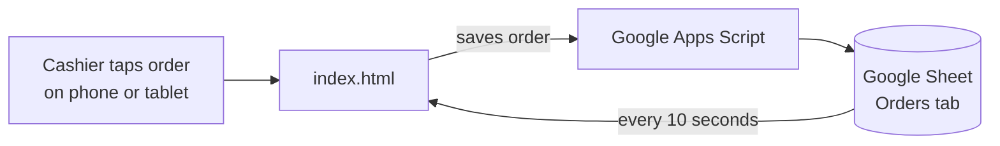

<div align="center">

# ☕ GWC Coffee Register

**A tap-to-order register for the Girls Who Code coffee fundraiser.**
Tap the drinks, tap how they paid, and every order lands in a Google Sheet automatically.


</div>

---

## Why we built this

Last year every sale was typed into a spreadsheet by hand: one row per item, payment method typed out, totals added up at the end. It was slow, orders were missing payment methods, and the line backed up while the cashier typed.

This register replaces all of that. One order takes **two or three taps**.

## Features

| | |
|---|---|
| **Tap to order** | Big buttons for every menu item, built for phones and tablets |
| **Add-ons per drink** | Oatmilk and cold foam toggles on each latte |
| **One-tap checkout** | Tapping the payment method saves the order |
| **Cash change** | Pick what the customer handed you and the register shows the change |
| **Undo and void** | Fix a mis-tap right away, or void any order from the Orders tab |
| **Live totals** | Total raised, items sold, money by payment method, and a cash drawer check |
| **Member points** | Optional name field so members can claim their points |
| **Google Sheets log** | Every order is saved as a row in a shared Google Sheet |
| **Excel export** | Download all orders plus a summary as an `.xlsx` file |
| **Multiple cashiers** | Several devices can ring up orders into the same sheet |

## Menu

| Item | Price |
|---|---|
| Vanilla Latte | $5.00 |
| Pumpkin Latte | $5.00 |
| Oatmilk (add-on) | $0.50 |
| Cold Foam (add-on) | $0.50 |
| Pan Dulce | $2.00 |
| Coffee + Pastry promo | $7.00 |

## How it works



1. The register (`index.html`) runs in any browser.
2. When the cashier taps a payment method, the order is sent to a Google Apps Script web app.
3. The script adds a new row to the **Orders** tab of the Google Sheet.
4. Each device reloads the order list every 10 seconds, so all cashiers see the same totals.

## Project structure

```
gwc-register/
├── index.html         # The register app (HTML, CSS and JavaScript in one file)
├── apps-script.gs     # Code that runs in Google Apps Script and writes to the sheet
├── README.md          # You are here
└── .gitignore
```

## Setup

### 1. Run it locally
1. Clone the repo and open the folder in VS Code.
2. Install the **Live Server** extension.
3. Right-click `index.html` and choose **Open with Live Server**.

### 2. Connect the Google Sheet
1. Create a Google Sheet and open **Extensions → Apps Script**.
2. Paste the code from `apps-script.gs`.
3. Click **Deploy → New deployment**, choose **Web app**, set **Execute as: Me** and **Who has access: Anyone**.
4. Copy the web app URL and paste it into `API_URL` in `index.html`.

### 3. Publish
Deploy with **GitHub Pages** (Settings → Pages → Deploy from branch `main`) or drag the folder onto **Netlify Drop**.

## Using it at the table

1. Tap **Vanilla Latte**, **Pumpkin Latte** or **Pan Dulce**.
2. Tap **Oatmilk** or **Cold foam** on any latte that needs it.
3. Type a member name if they want points.
4. Tap how they paid. For **Cash**, tap what they handed you to see the change.
5. Check the **Totals** tab at the end of the day and count the drawer.

## Built by

Made with 💜 by the **Girls Who Code** club for our coffee fundraiser.
